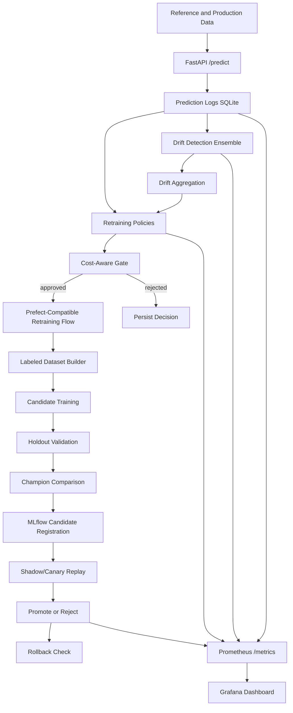

# Production ML Monitoring & Auto-Retraining Pipeline

Production-style MLOps project that demonstrates serving, prediction logging, drift detection, cost-aware retraining decisions, candidate validation, MLflow lifecycle management, rollback safety, and Prometheus/Grafana observability.

Many portfolio MLOps projects stop at `train model -> deploy FastAPI`. This project focuses on the harder operational questions:

- How do we know production data changed?
- How reliable are drift alarms?
- When should drift actually cause retraining?
- Is retraining worth its cost?
- How do we safely deploy or reject a replacement model?
- How do we observe the whole lifecycle?

## Final Architecture



## Tech Stack

Python, FastAPI, scikit-learn, pandas, NumPy, MLflow, River, SciPy, Prefect-compatible orchestration, SQLAlchemy, SQLite, Prometheus, Grafana, Docker Compose, pytest.

## Quick Start

### Option A: Docker Compose

This is the recommended local full-stack path. It starts MLflow, bootstraps the champion model if the MLflow `champion` alias is missing, starts FastAPI and the bundled frontend, then starts Prometheus and Grafana.

```bash
copy .env.example .env
docker compose up --build
```

On macOS/Linux, use:

```bash
cp .env.example .env
docker compose up --build
```

The `model-init` service runs once before the API:

```text
prepare deterministic data if missing
→ train baseline model if champion alias is missing
→ register production-monitoring-model@champion in MLflow
→ allow API startup
```

Open the frontend console:

```text
http://localhost:8000
```

The console supports dataset upload, training status, model metrics, MLflow links, and embedded Grafana graphs.

If you previously saw:

```text
Registered model alias champion not found
```

run:

```bash
docker compose down
docker compose up --build
```

If `model-init` fails with:

```text
/api/2.0/mlflow/logged-models failed with error code 404
```

your API image was built with an MLflow client version newer than the MLflow server image. Rebuild after pulling the latest repository changes:

```bash
docker compose down
docker compose build --no-cache api model-init
docker compose up
```

To force a completely fresh Docker demo state:

```bash
docker compose down -v
docker compose up --build
```

Useful Docker commands:

```bash
docker compose ps
docker compose logs model-init
docker compose logs api
```

If the same error repeats after a fix, force Compose to recreate the one-shot bootstrap container as well as rebuilding the image:

```bash
docker compose down
docker compose up --build --force-recreate model-init api prometheus grafana
```

The bootstrap now validates that `production-monitoring-model@champion` can actually be loaded from MLflow artifacts. If the alias exists but points to missing artifacts from an earlier failed run, `model-init` retrains and repoints the alias automatically.

Important Docker note: MLflow stores model artifacts under `/mlflow/artifacts` inside the MLflow container. The API and `model-init` containers mount the same host `./mlflow` directory at `/mlflow`, so the registered model artifact URI resolves in every container. Do not remove the `./mlflow:/mlflow` mounts unless you also change MLflow artifact serving.

If Grafana opens but the dashboard list is empty, recreate Grafana so provisioning is re-read:

```bash
docker compose up -d --force-recreate grafana
```

Then open:

```text
http://localhost:3000/dashboards
```

The provisioned dashboard should appear under:

```text
MLOps / ML Monitoring & Auto-Retraining
```

Grafana provisioning uses:

```text
./observability/grafana/provisioning -> /etc/grafana/provisioning
./observability/grafana/dashboards   -> /etc/grafana/dashboards
```

### Option B: Local Python

```bash
pip install -r requirements.txt
python scripts/prepare_data.py
mlflow server --host 0.0.0.0 --port 5000 --backend-store-uri sqlite:///mlflow.db --default-artifact-root ./mlruns
```

In a second terminal:

```bash
python scripts/train_model.py
uvicorn app.main:app --reload
```

Then open the frontend:

```text
http://localhost:8000
```

The frontend is served by FastAPI from `app/static`. It can upload a CSV dataset, start a training job, poll job status, show model metrics, link to MLflow, and embed Grafana when Grafana is running.

In a third terminal:

```bash
python scripts/simulate_production.py --api-url http://localhost:8000 --limit 250 --include-ground-truth
python scripts/simulate_production.py --api-url http://localhost:8000 --limit 750 --drift-start 350 --drift-type sudden --include-ground-truth
python scripts/run_drift_detection.py
python scripts/run_retraining_policy.py --policy drift_triggered
python scripts/run_retraining_flow.py --policy drift_triggered
```

## Useful URLs

- Frontend console: <http://localhost:8000>
- FastAPI root: <http://localhost:8000>
- Swagger: <http://localhost:8000/docs>
- Metrics: <http://localhost:8000/metrics>
- MLflow: <http://localhost:5000>
- Prometheus: <http://localhost:9090>
- Grafana: <http://localhost:3000>

Grafana defaults for local development are controlled by `.env`:

```text
GRAFANA_ADMIN_USER=admin
GRAFANA_ADMIN_PASSWORD=admin
```

Docker Compose enables Grafana iframe embedding and anonymous viewer access for local development so the dashboard can render inside the frontend console. If you run Grafana outside Compose, configure equivalent settings:

```text
GF_SECURITY_ALLOW_EMBEDDING=true
GF_AUTH_ANONYMOUS_ENABLED=true
GF_AUTH_ANONYMOUS_ORG_ROLE=Viewer
```

The project works without a `.env` file because Docker Compose has defaults for Grafana and the app has code defaults. Creating `.env` from `.env.example` is still recommended so all ports, model names, thresholds, and credentials are visible in one place.

## Week 1 - Serving + Data Foundation

This repository now contains the Week 1 foundation: deterministic dataset preparation, baseline model training, MLflow registration, FastAPI serving, prediction logging, production-stream simulation, Docker support, and focused tests.

### Install

```bash
pip install -r requirements.txt
```

### Prepare Data

```bash
python scripts/prepare_data.py
```

This creates:

- `data/processed/train.csv`
- `data/reference/reference.csv`
- `data/production/production.csv`
- `data/processed/holdout.csv`

### Start MLflow

```bash
mlflow server --host 0.0.0.0 --port 5000 --backend-store-uri sqlite:///mlflow.db --default-artifact-root ./mlruns
```

### Train and Register the Baseline Model

In a second terminal:

```bash
python scripts/train_model.py
```

The model is registered as `production-monitoring-model` and assigned the `champion` alias.

### Start the API

```bash
uvicorn app.main:app --reload
```

Open the frontend console:

```text
http://localhost:8000
```

### Use the Frontend Upload Flow

The frontend accepts CSV files in either of these schemas.

Synthetic project schema:

```text
feature_0,feature_1,feature_2,feature_3,feature_4,feature_5,feature_6,feature_7,feature_8,feature_9,target
```

Credit-card fraud schema:

```text
Time,V1,V2,V3,V4,V5,V6,V7,V8,V9,V10,V11,V12,V13,V14,V15,V16,V17,V18,V19,V20,V21,V22,V23,V24,V25,V26,V27,V28,Amount,Class
```

For other binary classification CSVs, use a numeric target column named `target`, `Class`, or `class`. The app uses all numeric feature columns and normalizes the label column to the internal `target` name before training.

Requirements:

- a supported target column must be present,
- feature and target values must be numeric,
- `target` must contain at least two classes,
- each target class must have at least 5 rows so the app can create stratified train/reference/production/holdout splits.

When you click **Train Model**, the backend:

1. saves the uploaded CSV under `data/uploads/<job_id>/source.csv`,
2. creates per-job splits under `data/training_jobs/<job_id>/`,
3. runs the existing MLflow training script against those splits,
4. registers the new model under `production-monitoring-model`,
5. refreshes the FastAPI prediction service with the latest `champion` model,
6. returns training metrics to the page.

The frontend polls these API endpoints:

```text
POST /training/upload
GET  /training/jobs
GET  /training/jobs/{job_id}
```

### Health Check

```bash
curl http://localhost:8000/health
```

### Prediction Example

```bash
curl -X POST http://localhost:8000/predict ^
  -H "Content-Type: application/json" ^
  -d "{\"features\":{\"feature_0\":0.1,\"feature_1\":0.2,\"feature_2\":0.3,\"feature_3\":0.4,\"feature_4\":0.5,\"feature_5\":0.6,\"feature_6\":0.7,\"feature_7\":0.8,\"feature_8\":0.9,\"feature_9\":1.0},\"ground_truth\":1}"
```

### Run the Production Simulator

```bash
python scripts/simulate_production.py --api-url http://localhost:8000 --limit 100 --delay 0.1 --include-ground-truth
```

### Inspect Prediction Logs

```bash
python scripts/count_prediction_logs.py
```

Or, if the SQLite CLI is installed:

```bash
sqlite3 predictions.db "SELECT COUNT(*) FROM prediction_logs;"
```

### Run Tests

```bash
pytest
```

### Docker Compose

```bash
docker compose up --build
```

Docker Compose includes a one-shot `model-init` service that prepares data and registers the champion model before the API starts.

## Week 2 - Drift Detection Ensemble

Week 2 adds a local drift-monitoring layer on top of the existing reference split and `prediction_logs` table.

Implemented detectors:

- PSI feature drift using deterministic reference quantile bins.
- KS-test feature drift using `scipy.stats.ks_2samp`.
- ADWIN concept drift using prediction error when `ground_truth` is logged.
- Prediction-confidence drift using absolute change in mean binary confidence.
- Weighted drift aggregation with severity levels, triggered detectors, and top drifting features.

Drift measurements are stored in `drift_measurements`; aggregate alerts are stored in `drift_alerts`.

### Run Drift Detection

Start the normal Week 1 dependencies first if you want fresh prediction logs:

```bash
mlflow server --host 0.0.0.0 --port 5000 --backend-store-uri sqlite:///mlflow.db --default-artifact-root ./mlruns
python scripts/train_model.py
uvicorn app.main:app --reload
```

Simulate normal production:

```bash
python scripts/simulate_production.py --api-url http://localhost:8000 --limit 250 --include-ground-truth
```

Simulate known sudden drift:

```bash
python scripts/simulate_production.py --api-url http://localhost:8000 --limit 750 --drift-start 350 --drift-type sudden --drift-strength 1.5 --include-ground-truth --metadata-path artifacts/synthetic_drift_metadata.json
```

Run the detector ensemble on the latest prediction-log window:

```bash
python scripts/run_drift_detection.py
```

If fewer than `MIN_DRIFT_SAMPLES` prediction rows exist, the monitor persists an `insufficient_data` result instead of raising a misleading alert.

### Benchmark Detectors

Run the reproducible benchmark:

```bash
python scripts/benchmark_detectors.py --rows 750 --drift-start 350 --drift-type sudden --window-size 100 --step-size 25 --output-csv artifacts/drift_benchmark.csv
```

Definitions:

- Detection latency is the first deduplicated alert index at or after the known drift start minus `drift_start`.
- False alarms are deduplicated alerts before `drift_start - window_size`.
- Alert deduplication uses a cooldown of half the benchmark window size.

Latest generated benchmark:

| Detector | Detection Rate | False Alarm Rate | Detection Latency |
| --- | ---: | ---: | ---: |
| psi | 1.00 | 0.33 | 24 |
| ks | 1.00 | 1.00 | 24 |
| adwin | 1.00 | 0.00 | 18 |
| confidence | 1.00 | 0.00 | 49 |
| ensemble | 1.00 | 1.33 | 49 |

Outputs:

- `artifacts/drift_benchmark.csv`
- `artifacts/drift_benchmark.metadata.json`

Verify persisted drift state:

```bash
python -c "import sqlite3; c=sqlite3.connect('predictions.db'); print(c.execute('select count(*) from drift_measurements').fetchone()); print(c.execute('select severity, overall_score, drift_detected, window_size from drift_alerts order by id desc limit 1').fetchone())"
```

## Week 3 - Retraining Policy Engine + Orchestration

Week 3 adds policy-driven retraining decisions, a deterministic cost-aware gate, candidate training, holdout/champion validation, local replay-based shadow/canary evaluation, promotion, rollback helpers, lifecycle persistence, and policy benchmarking.

Supported policies:

- `periodic`: proposes retraining after `PERIODIC_RETRAIN_INTERVAL` observations.
- `error_threshold`: proposes retraining when rolling labeled error exceeds `ERROR_RETRAIN_THRESHOLD`.
- `drift_triggered`: proposes retraining from the latest Week 2 aggregate drift alert when severity/score passes the configured threshold, with cooldown.

The cost-aware gate uses abstract cost units:

```text
estimated_drift_cost = performance_degradation * EXPECTED_FUTURE_REQUESTS * BUSINESS_ERROR_COST_WEIGHT
estimated_retraining_cost = FIXED_RETRAIN_COST + sample_cost + DEPLOYMENT_COST_PENALTY
```

### Evaluate A Policy

```bash
python scripts/run_retraining_policy.py --policy drift_triggered
python scripts/run_retraining_policy.py --policy error_threshold
python scripts/run_retraining_policy.py --policy periodic
```

Each command persists to `retraining_decisions`.

### Run The Retraining Flow

```bash
python scripts/run_retraining_flow.py --policy drift_triggered
```

Flow:

```text
policy -> cost-aware gate -> labeled dataset -> candidate training -> holdout validation -> champion comparison -> MLflow registration -> shadow/canary replay -> promotion
```

If the policy or cost gate rejects retraining, the flow persists the decision and exits before training. Candidate failures are recorded as rejected and do not replace the champion.

### Policy Benchmark

Run all policies against the same deterministic drift stream:

```bash
python scripts/benchmark_policies.py --rows 750 --drift-start 350 --drift-type sudden --window-size 100 --step-size 50 --output-csv artifacts/policy_benchmark.csv --timeseries-csv artifacts/policy_performance_timeseries.csv
```

Latest generated benchmark:

| Policy | Retrains | Avg F1 | Final F1 | Retrain Cost | Drift Cost | Total Cost |
| --- | ---: | ---: | ---: | ---: | ---: | ---: |
| periodic | 1 | 0.843 | 0.857 | 32.00 | 255.00 | 287.00 |
| error_threshold | 7 | 0.858 | 0.857 | 225.40 | 880.00 | 1105.40 |
| drift_triggered | 2 | 0.858 | 0.857 | 64.40 | 195.00 | 259.40 |

Outputs:

- `artifacts/policy_benchmark.csv`
- `artifacts/policy_benchmark.metadata.json`
- `artifacts/policy_performance_timeseries.csv`

Inspect lifecycle persistence:

```bash
python -c "import sqlite3; c=sqlite3.connect('predictions.db'); print('decisions', c.execute('select count(*) from retraining_decisions').fetchone()[0]); print('runs', c.execute('select count(*) from retraining_runs').fetchone()[0]); print('events', c.execute('select count(*) from deployment_events').fetchone()[0]); print('latest_decision', c.execute('select policy, policy_triggered, cost_approved, final_should_retrain, observation_index from retraining_decisions order by id desc limit 1').fetchone())"
```

Inspect MLflow champion alias after a successful promoted run:

```bash
python -c "import mlflow; from app.core.config import get_settings; s=get_settings(); c=mlflow.tracking.MlflowClient(tracking_uri=s.mlflow_tracking_uri); print(c.get_model_version_by_alias(s.mlflow_model_name, s.mlflow_model_alias).version)"
```

## Week 4 - Observability, Demo, and Final Results

### Prometheus Metrics

The API exposes real event-driven metrics at:

```bash
curl http://localhost:8000/metrics
```

Key metric families:

- `mlops_predictions_total`
- `mlops_prediction_latency_seconds`
- `mlops_model_accuracy`, `mlops_model_f1`, `mlops_model_error_rate`
- `mlops_drift_score`, `mlops_psi_score`, `mlops_ks_statistic`
- `mlops_retrain_proposals_total`, `mlops_retrain_approved_total`
- `mlops_estimated_drift_cost`, `mlops_estimated_retraining_cost`, `mlops_retraining_net_benefit`
- `mlops_candidates_registered_total`, `mlops_candidates_rejected_total`, `mlops_model_promotions_total`, `mlops_model_rollbacks_total`

Drift severity is exposed numerically:

```text
NONE=0 LOW=1 MEDIUM=2 HIGH=3 CRITICAL=4
```

### Grafana Dashboard

Docker Compose provisions one dashboard:

```text
ML Monitoring & Auto-Retraining
```

Major panels:

- system overview,
- prediction throughput and latency,
- rolling model accuracy/F1/error,
- drift score and alert rate,
- PSI and KS by feature,
- confidence drift,
- retraining event markers,
- cost-aware decision metrics,
- lifecycle events,
- alarm-rate visualization.

Provisioning files:

- `observability/prometheus.yml`
- `observability/grafana/provisioning/datasources/prometheus.yml`
- `observability/grafana/provisioning/dashboards/dashboards.yml`
- `observability/grafana/dashboards/mlops-dashboard.json`

### Demo Commands

Synthetic scenario:

```bash
python scripts/run_demo.py --scenario synthetic
```

Business credit-risk scenario:

```bash
python scripts/run_business_scenario.py --output-dir artifacts/business --rows 1800 --drift-start 350 --random-seed 123
```

All reproducible demo artifacts:

```bash
python scripts/run_demo.py --scenario all
```

Lightweight stress test, with the API already running:

```bash
python scripts/stress_test.py --api-url http://localhost:8000 --requests 50 --output-json artifacts/stress_test.json
```

Readiness check:

```bash
python scripts/verify_project.py
```

### Final Results

See [docs/RESULTS.md](docs/RESULTS.md).

Detector benchmark:

| Detector | Detection Rate | False Alarm Rate | Detection Latency |
| --- | ---: | ---: | ---: |
| psi | 1.00 | 0.33 | 24 |
| ks | 1.00 | 1.00 | 24 |
| adwin | 1.00 | 0.00 | 18 |
| confidence | 1.00 | 0.00 | 49 |
| ensemble | 1.00 | 1.33 | 49 |

Policy benchmark:

| Policy | Retrains | Avg F1 | Final F1 | Retrain Cost | Drift Cost | Total Cost |
| --- | ---: | ---: | ---: | ---: | ---: | ---: |
| periodic | 1 | 0.843 | 0.857 | 32.00 | 255.00 | 287.00 |
| error_threshold | 7 | 0.858 | 0.857 | 225.40 | 880.00 | 1105.40 |
| drift_triggered | 2 | 0.858 | 0.857 | 64.40 | 195.00 | 259.40 |

Stress test:

| Requests | Successes | Failures | Throughput RPS | Avg Latency ms | P95 Latency ms |
| ---: | ---: | ---: | ---: | ---: | ---: |
| 50 | 50 | 0 | 33.29 | 30.04 | 47.29 |

### Findings

- ADWIN detected the synthetic concept change fastest in the executed benchmark, with 18-observation latency and no false alarms.
- KS detected drift but produced the highest false-alarm rate among individual detectors in this run.
- The drift-triggered policy achieved the same final F1 as the error-threshold policy with fewer retrains and lower total abstract cost units.
- The business scenario shows the same benchmarking path on a deterministic credit-risk-style dataset without committing a large external dataset.

### Demo Assets

- Demo guide: [docs/DEMO.md](docs/DEMO.md)
- Results: [docs/RESULTS.md](docs/RESULTS.md)
- Screenshot directory: `docs/images/`
- Grafana dashboard JSON: `observability/grafana/dashboards/mlops-dashboard.json`

### Resume Bullet

Built a production-style MLOps pipeline with FastAPI serving, MLflow registry management, PSI/KS/ADWIN drift monitoring, cost-aware automated retraining, shadow/canary validation, rollback protection, and Prometheus/Grafana observability; benchmarked detector latency/false alarms and retraining policies, with the drift-triggered policy matching final F1 while reducing retrains versus error-threshold retraining in the executed synthetic scenario.
