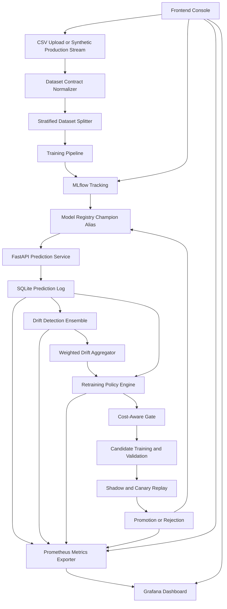

# Production ML Monitoring and Auto-Retraining Pipeline

End-to-end MLOps platform for supervised binary classification with production-style model serving, prediction telemetry, statistical drift detection, policy-driven retraining, MLflow model registry integration, Prometheus metrics, Grafana dashboards, and a frontend operations console for dataset upload and training execution.

The project goes beyond a simple `train -> serve` demo. It implements the operational control plane around a model: feature contract validation, online prediction logging, drift quantification, retraining decision policies, cost-aware gating, candidate validation, model promotion, rollback signals, and observability instrumentation.

## What This Project Does

This repository simulates a production ML system where a model is continuously monitored after deployment. Incoming predictions are logged with request metadata, feature payloads, ground truth labels when available, model version, latency, and probability outputs. Those logs drive statistical monitoring and retraining workflows.

Core capabilities:

- FastAPI inference service with strict feature-schema validation.
- Frontend console for CSV upload, automatic dataset splitting, training execution, and result visualization.
- MLflow tracking and model registry with a `champion` alias for active model resolution.
- Prometheus-compatible `/metrics` endpoint for model, drift, retraining, and lifecycle telemetry.
- Grafana dashboard provisioning for live model performance, drift, latency, throughput, and retraining events.
- Drift detection ensemble using PSI, KS-test, ADWIN concept drift, and confidence distribution shift.
- Policy engine for periodic, error-threshold, and drift-triggered retraining proposals.
- Cost-aware retraining gate that compares expected drift cost against retraining and deployment cost.
- Candidate training, holdout validation, champion comparison, shadow/canary replay, promotion, rejection, and rollback indicators.

## Frontend Workflow

The frontend is served directly by FastAPI at:

```text
http://localhost:8000
```

It supports uploading datasets such as:

```text
feature_0 ... feature_9, target
```

and Kaggle-style credit-card fraud datasets:

```text
Time, V1 ... V28, Amount, Class
```

When a CSV is uploaded, the backend performs the full pipeline:

1. persists the source file under `data/uploads/<job_id>/`,
2. normalizes the target column to the internal `target` contract,
3. creates stratified train/reference/production/holdout splits,
4. writes `dataset_metadata.json` with feature columns and split metadata,
5. trains a scikit-learn pipeline,
6. logs parameters, metrics, artifacts, and input examples to MLflow,
7. registers a new model version,
8. updates the `champion` alias,
9. refreshes the FastAPI prediction service,
10. returns metrics to the frontend.

The same page links to MLflow and embeds the Grafana dashboard when Grafana is running.

## Architecture



## Technical Stack

- API and serving: FastAPI, Pydantic, Uvicorn
- ML training: scikit-learn, pandas, NumPy
- Registry and experiment tracking: MLflow
- Drift detection: PSI, Kolmogorov-Smirnov tests, River ADWIN, confidence-shift monitoring
- Persistence: SQLite, SQLAlchemy
- Observability: Prometheus client metrics, Prometheus server, Grafana dashboards
- Orchestration style: Prefect-compatible retraining flow boundaries
- Testing: pytest, FastAPI TestClient
- Deployment path: Docker Compose with MLflow, API, Prometheus, and Grafana services

## Achieved Results

### Credit-Card Fraud Upload Training

The frontend upload path was verified against a real `creditcard.csv`-style dataset. The pipeline accepted the `Class` target column, generated train/reference/production/holdout splits, trained the model, registered the new version in MLflow, and refreshed the prediction API.

Latest verified model:

| Metric | Value |
| --- | ---: |
| Accuracy | 0.9992626663 |
| Precision | 0.8684210526 |
| Recall | 0.6734693878 |
| F1 | 0.7586206897 |
| ROC AUC | 0.9635987907 |
| Registered Model Version | 4 |

The API was also verified with credit-card feature payloads after training:

```text
model_name: production-monitoring-model
model_version: 4
prediction: 0
probability: 0.0001228492
```

### Drift Detector Benchmark

The drift benchmark evaluates detectors on a deterministic synthetic concept-shift scenario.

| Detector | Detection Rate | False Alarm Rate | Detection Latency |
| --- | ---: | ---: | ---: |
| PSI | 1.00 | 0.33 | 24 |
| KS | 1.00 | 1.00 | 24 |
| ADWIN | 1.00 | 0.00 | 18 |
| Confidence Drift | 1.00 | 0.00 | 49 |
| Ensemble | 1.00 | 1.33 | 49 |

Interpretation: ADWIN produced the fastest concept-drift signal in the executed benchmark, while the ensemble aggregates heterogeneous feature, distributional, confidence, and label-error signals into a unified operational severity score.

### Retraining Policy Benchmark

The retraining benchmark compares policy behavior under the same deterministic drift stream.

| Policy | Retrains | Avg F1 | Final F1 | Retrain Cost | Drift Cost | Total Cost |
| --- | ---: | ---: | ---: | ---: | ---: | ---: |
| Periodic | 1 | 0.843 | 0.857 | 32.00 | 255.00 | 287.00 |
| Error Threshold | 7 | 0.858 | 0.857 | 225.40 | 880.00 | 1105.40 |
| Drift Triggered | 2 | 0.858 | 0.857 | 64.40 | 195.00 | 259.40 |

Interpretation: the drift-triggered policy achieved the same final F1 as error-threshold retraining while materially reducing retraining frequency and total abstract operating cost.

### Stress Test

| Requests | Successes | Failures | Throughput RPS | Avg Latency ms | P95 Latency ms |
| ---: | ---: | ---: | ---: | ---: | ---: |
| 50 | 50 | 0 | 33.29 | 30.04 | 47.29 |

## Observability Surface

The API exports Prometheus metrics at:

```text
http://localhost:8000/metrics
```

Important metric families:

- `mlops_predictions_total`
- `mlops_prediction_latency_seconds`
- `mlops_model_accuracy`
- `mlops_model_f1`
- `mlops_model_error_rate`
- `mlops_drift_score`
- `mlops_psi_score`
- `mlops_ks_statistic`
- `mlops_retrain_proposals_total`
- `mlops_retrain_approved_total`
- `mlops_estimated_drift_cost`
- `mlops_estimated_retraining_cost`
- `mlops_retraining_net_benefit`
- `mlops_candidates_registered_total`
- `mlops_candidates_rejected_total`
- `mlops_model_promotions_total`
- `mlops_model_rollbacks_total`

Grafana dashboard panels include:

- total predictions,
- active model version,
- prediction throughput,
- p50 and p95 prediction latency,
- rolling accuracy, F1, and error rate,
- aggregate drift score,
- drift severity,
- PSI by feature,
- KS statistic by feature,
- confidence drift,
- retraining proposals and approvals,
- model lifecycle events,
- rollback and promotion markers.

## Run The Project

### Full Stack With Docker Compose

```bash
copy .env.example .env
docker compose up --build
```

On macOS/Linux:

```bash
cp .env.example .env
docker compose up --build
```

Open:

```text
Frontend:   http://localhost:8000
Swagger:    http://localhost:8000/docs
MLflow:     http://localhost:5000
Prometheus: http://localhost:9090
Grafana:    http://localhost:3000
```

### Local Python

```bash
pip install -r requirements.txt
python scripts/prepare_data.py
mlflow server --host 0.0.0.0 --port 5000 --backend-store-uri sqlite:///mlflow.db --default-artifact-root ./mlruns
```

In another terminal:

```bash
python scripts/train_model.py
uvicorn app.main:app --reload
```

Open:

```text
http://localhost:8000
```

## Repository Map

```text
app/
  api/                  FastAPI routes and frontend training upload workflow
  db/                   SQLAlchemy models and database initialization
  drift/                PSI, KS, ADWIN, confidence drift, aggregation
  ml/                   Feature contracts and MLflow model loading
  observability/        Prometheus metric definitions and refresh logic
  policies/             Retraining policy engine and persistence
  retraining/           Candidate training, validation, deployment lifecycle
  services/             Prediction service and request logging
  static/               Frontend console
observability/
  grafana/              Provisioned dashboards and datasource configuration
  prometheus.yml        Prometheus scrape configuration
scripts/                Data prep, training, simulation, drift, policy, demo scripts
tests/                  Unit and integration coverage
weeks.md                Detailed week-by-week implementation notes
```

## Verification

The current implementation has been validated with:

```text
59 passed
```

Coverage includes prediction validation, logging, drift detectors, drift aggregation, policy evaluation, cost-aware retraining decisions, observability metrics, upload training flow, and deployment validation logic.

## Portfolio Summary

This project demonstrates a production-grade ML monitoring and auto-retraining control plane with online inference, telemetry persistence, statistical drift surveillance, cost-sensitive retraining governance, candidate model lifecycle management, registry-backed deployment semantics, and full-stack observability through Prometheus and Grafana. It is designed to show practical MLOps system design rather than only offline modeling performance.
